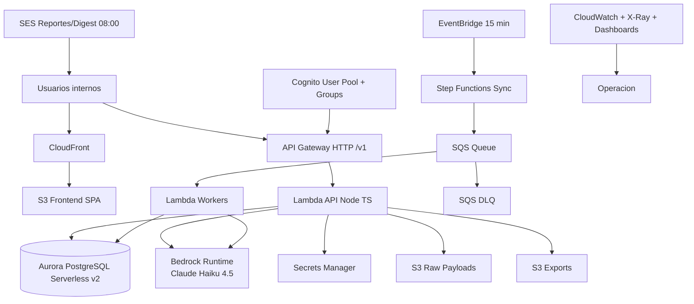

# AWS

## Objetivo
Definir la arquitectura AWS de `claro_data` para V1 con una app unificada de monitoreo de marca Claro Colombia, integrando social propio, listening competitivo y noticias.

## Region y contexto
- Region objetivo: `us-east-1`
- Ambiente: `prod` unico
- Zona horaria de operacion de negocio: `America/Bogota`

## Diagrama Logico

## Componentes y engrane

### Edge/UI
- `S3 + CloudFront` para SPA (`React + Vite + TypeScript`).

### Auth
- Cognito User Pool.
- Grupos: `Admin`, `Analyst`, `Viewer`.
- JWT Authorizer en API Gateway + enforcement RBAC en backend.

### API
- API Gateway HTTP `/v1/*`.
- Lambdas Node.js/TypeScript para dominio funcional.

### Orquestacion
- EventBridge cada 15 min.
- Step Functions para sync multifuente.
- SQS para desacople y control de concurrencia.
- DLQ para reprocesos.

### Datos
- Aurora PostgreSQL Serverless v2.
- Prisma ORM + migraciones.
- FTS para busqueda avanzada.

### Storage
- S3 raw payloads.
- S3 exports.
- S3 frontend.

### IA
- Bedrock fijo `anthropic.claude-haiku-4-5-20251001-v1:0`.
- Prompt versioning en repositorio.

### Email/reportes
- SES para digest y reportes programados.

### Observabilidad
- CloudWatch Logs/Metrics.
- X-Ray.
- Dashboards de operacion y costo.

## Vision funcional V1 sobre esta arquitectura

### Fuentes unificadas
- Hootsuite (cuentas propias)
- Awario (menciones externas/competencia)
- News providers

### Cadencia
- Pull programado cada 15 minutos por fuente.

### KPIs oficiales
- `BHS` (Brand Health Score)
- `SOV` (Share of Voice)
- `sentimiento_neto`
- `riesgo_activo`

### Metas
- SOV: +5 pp trimestral
- BHS: >=70 sostenido
- SLA SEV-1: <=30 min

## Seguridad
- Secrets en Secrets Manager.
- Cifrado KMS en datos y logs.
- IAM least privilege.
- Auditoria de cambios criticos.
- PII minimizada/enmascarada por defecto.

## Tags obligatorios
- `claro=true`
- `app=claro-data`
- `env=prod`
- `owner=<equipo_responsable>`
- `cost-center=<centro_costos>`
- `managed-by=terraform`

## Objetivos operativos V1
- Ingesta/sync disponible <= 15 min.
- Clasificacion de 100 items <= 10 min.
- Disponibilidad objetivo: 99.5%.
- Recuperacion DB: RPO 15m / RTO 2h.

## Actualización operativa: Awario Comments V1 (2026-02-20)

### Flags y variables de runtime
- `AWARIO_ACCESS_TOKEN`
- `AWARIO_COMMENTS_ENABLED`
- `AWARIO_API_BASE_URL`
- `AWARIO_SYNC_WINDOW_DAYS`
- `AWARIO_SYNC_PAGE_LIMIT`
- `AWARIO_SYNC_MAX_PAGES_PER_ALERT`
- `AWARIO_SYNC_THROTTLE_MS`
- `AWARIO_COMMENTS_REVIEW_THRESHOLD`

### Ejecución de sync
- El endpoint `POST /v1/connectors/{id}/sync` ahora ejecuta sincronización real para el provider `awario`.
- Métricas de corrida publicadas en `ConnectorSyncRun.metrics`:
  - `fetched`
  - `linked`
  - `persisted`
  - `deduped`
  - `skipped_unlinked`
  - `flagged_spam`
  - `flagged_related`
  - `errors`

### Gobernanza de configuración
- `AwarioQueryProfile`: query interna de negocio.
- `AwarioAlertBinding`: mapeo hacia `awario_alert_id` con validación contra `alerts/list`.
- Mantener administración vía API interna + auditoría (`AuditLog`).

### Rollout recomendado
1. Activar en staging con `AWARIO_COMMENTS_ENABLED=true`.
2. Verificar ratio de vinculación (`linked/fetched`) y volumen de `skipped_unlinked`.
3. Revisar errores de rate-limit y latencia del conector.
4. Habilitar gradualmente en producción.

## Runbook deploy Frontend (Amplify)

### Contexto operativo (2026-02-20)
- El workflow de GitHub `Deploy Frontend (AWS Amplify)` puede fallar en `Configure AWS credentials` con:
  - `The security token included in the request is invalid.`
- En ese escenario, el deploy automático no inicia (`Start Amplify deployment` queda `skipped`).

### Verificación rápida
1. Validar identidad AWS con variables cargadas desde `.env`:
   - `set -a && source .env && set +a`
   - `aws sts get-caller-identity --region us-east-1`
2. Verificar app Amplify objetivo:
   - `aws amplify list-apps --region us-east-1`
   - app esperada V1: `claro_data_ai` (`d34ae2z3oew4p`)

### Deploy manual de contingencia
1. Iniciar release:
   - `aws amplify start-job --app-id d34ae2z3oew4p --branch-name main --job-type RELEASE --region us-east-1`
2. Monitorear estado:
   - `aws amplify get-job --app-id d34ae2z3oew4p --branch-name main --job-id <JOB_ID> --region us-east-1`
3. Smoke test:
   - `https://main.d34ae2z3oew4p.amplifyapp.com/`
   - `https://main.d34ae2z3oew4p.amplifyapp.com/login`
   - `https://main.d34ae2z3oew4p.amplifyapp.com/app/monitor/social-overview`

### Acción preventiva en GitHub Actions
- Revisar secretos del repo usados por `.github/workflows/deploy-amplify-main.yml`:
  - `AWS_ACCESS_KEY_ID`
  - `AWS_SECRET_ACCESS_KEY`
  - `AWS_AMPLIFY_APP_ID`
- Si se usan credenciales temporales STS, incluir también `AWS_SESSION_TOKEN` en el workflow.
