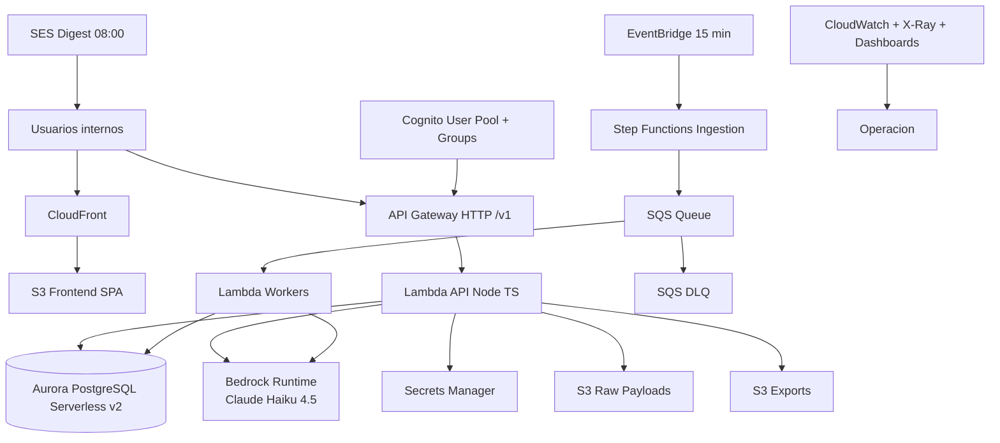

# AWS

## Objetivo
Definir la arquitectura base de `claro_data` para V1 en AWS con escalabilidad serverless, seguridad por defecto y preparacion para conectores de social media.

## Diagrama Logico

## Componentes y Como Se Engranan

### Edge/UI
- `S3 + CloudFront` para SPA (`React + Vite + TypeScript`).
- Dominio inicial: URL nativa CloudFront.

### Auth
- Cognito User Pool.
- Grupos: `Admin`, `Analyst`, `Viewer`.
- JWT Authorizer en API Gateway + enforcement RBAC en backend.

### API
- API Gateway HTTP con rutas versionadas `/v1/*`.
- Lambdas Node.js/TypeScript para dominio de negocio.

### Orquestacion
- EventBridge dispara ingesta cada 15 minutos.
- Step Functions controla fetch -> normalize -> dedupe -> persist -> classify.
- SQS desacopla procesamiento y controla concurrencia.
- DLQ para reprocesos e incidentes.

### Datos
- Aurora PostgreSQL Serverless v2 (single region `us-east-1`).
- Prisma ORM para modelo y migraciones.
- PostgreSQL FTS para busqueda textual avanzada.

### Storage
- S3 `raw payloads` (versionado, lifecycle).
- S3 `exports` (CSV).
- S3 `frontend` para artefactos web.

### IA
- Bedrock modelo fijo:
  - `anthropic.claude-haiku-4-5-20251001-v1:0`
- Prompt versioning en repositorio.

### Email
- SES para digest diario a las 08:00.

### Observabilidad
- CloudWatch Logs/Metrics.
- X-Ray tracing.
- Dashboards operativos (sin alertas push en V1).

### Seguridad
- Secrets Manager para llaves externas.
- KMS en todos los componentes de datos.
- IAM least privilege.
- Auditoria de acciones de negocio.

## Estandar Obligatorio de Tags
Aplicar en **todos** los recursos AWS:
- `claro=true`
- `app=claro-data`
- `env=prod`
- `owner=<equipo_responsable>`
- `cost-center=<centro_costos>`
- `managed-by=terraform`

## Politica de Costos
- AWS Budget habilitado para plataforma.
- Limites diarios de clasificacion (cupo por termino/corrida).
- Control de concurrencia en workers y Step Functions.
- Dashboards de costo por servicio/tag.

## Preparacion para Social Media
- Arquitectura con interfaz de conectores (`fetch`, `normalize`, `rate_limit_policy`).
- `source_type` unificado (`news|social`) en modelo de datos.
- Integracion futura con terceros agregadores (ej. Hootsuite/Awario), sin OAuth directo con redes sociales.

## API v1 Base
- `GET /v1/terms`
- `POST /v1/terms`
- `PATCH /v1/terms/{id}`
- `POST /v1/ingestion/runs`
- `GET /v1/content`
- `PATCH /v1/content/{id}/state`
- `POST /v1/content/bulk/state`
- `PATCH /v1/content/{id}/classification`
- `POST /v1/analysis/runs`
- `GET /v1/analysis/history`
- `POST /v1/exports/csv`
- `GET /v1/meta`

## Objetivos Operativos (V1)
- Ingesta por corrida <= 5 minutos.
- Clasificacion de 100 articulos <= 10 minutos.
- Disponibilidad objetivo: 99.5%.
- Recuperacion DB: RPO 15m / RTO 2h.
