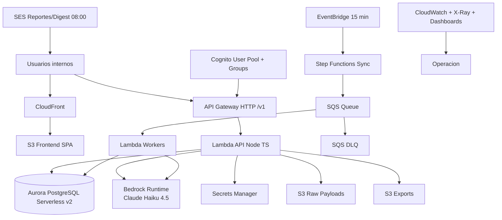

# AWS

## Objetivo
Definir la arquitectura AWS de `claro_data` para V1 con una app unificada de monitoreo de marca Claro Colombia, integrando social propio, listening competitivo y noticias.

## Region y contexto
- Region objetivo: `us-east-1`
- Ambiente: `prod` unico
- Zona horaria de operacion de negocio: `America/Bogota`

## Diagrama Logico

## Componentes y engrane

### Edge/UI
- `S3 + CloudFront` para SPA (`React + Vite + TypeScript`).

### Auth
- Cognito User Pool.
- Grupos: `Admin`, `Analyst`, `Viewer`.
- JWT Authorizer en API Gateway + enforcement RBAC en backend.

### API
- API Gateway HTTP `/v1/*`.
- Lambdas Node.js/TypeScript para dominio funcional.

### Orquestacion
- EventBridge cada 15 min.
- Step Functions para sync multifuente.
- SQS para desacople y control de concurrencia.
- DLQ para reprocesos.

### Datos
- Aurora PostgreSQL Serverless v2.
- Prisma ORM + migraciones.
- FTS para busqueda avanzada.

### Storage
- S3 raw payloads.
- S3 exports.
- S3 frontend.

### IA
- Bedrock fijo `anthropic.claude-haiku-4-5-20251001-v1:0`.
- Prompt versioning en repositorio.

### Email/reportes
- SES para digest y reportes programados.

### Observabilidad
- CloudWatch Logs/Metrics.
- X-Ray.
- Dashboards de operacion y costo.

## Vision funcional V1 sobre esta arquitectura

### Fuentes unificadas
- Hootsuite (cuentas propias)
- Awario (menciones externas/competencia)
- News providers

### Cadencia
- Pull programado cada 15 minutos por fuente.

### KPIs oficiales
- `BHS` (Brand Health Score)
- `SOV` (Share of Voice)
- `sentimiento_neto`
- `riesgo_activo`

### Metas
- SOV: +5 pp trimestral
- BHS: >=70 sostenido
- SLA SEV-1: <=30 min

## Seguridad
- Secrets en Secrets Manager.
- Cifrado KMS en datos y logs.
- IAM least privilege.
- Auditoria de cambios criticos.
- PII minimizada/enmascarada por defecto.

## Tags obligatorios
- `claro=true`
- `app=claro-data`
- `env=prod`
- `owner=<equipo_responsable>`
- `cost-center=<centro_costos>`
- `managed-by=terraform`

## Objetivos operativos V1
- Ingesta/sync disponible <= 15 min.
- Clasificacion de 100 items <= 10 min.
- Disponibilidad objetivo: 99.5%.
- Recuperacion DB: RPO 15m / RTO 2h.
